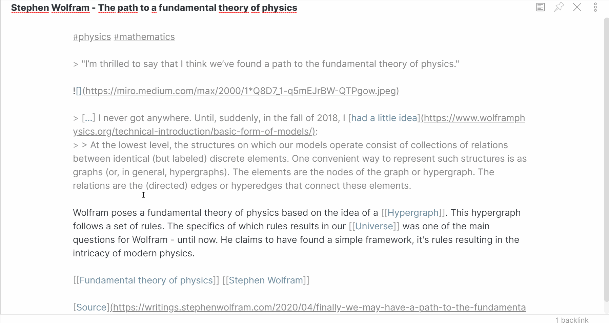
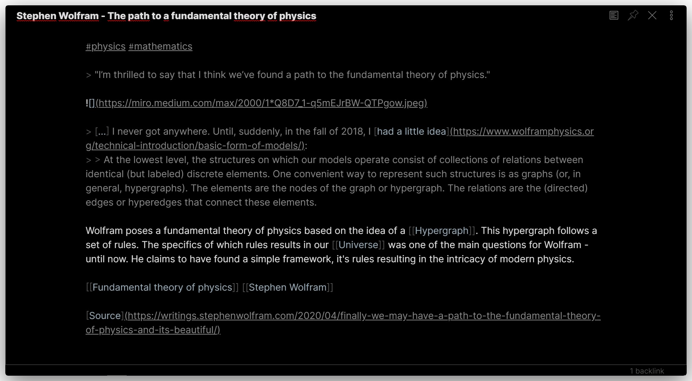

# Clean theme for Obsidian

A minimal and clean theme designed to be clutter-free and easy on the eye. Supports both dark and light mode.

## Features

- Clean colors

    Simple, neutral and close to monochrome, prioritizing high contrast where important.
	
	- [ ] Support for [pywal](https://github.com/dylanaraps/pywal)-generated colors

- UI cleanup

	Your content is the most important thing, and should be front and center. This theme hides as much unecessary UI as possible, only showing it when needed. 
	
	- The sidebars are hidden, and are shown by hovering to either side. Personally, I prefer using hotkeys to toggle them, which gives me a focused and effective workflow. This is supported by the theme.
	- Header icons (Drag to rearrange, Show preview, etc.) are hidden. These need only be visible when interacting with them, and are thus shown by hovering a header.

- Dark mode

    

- Light mode

	Should work, but not actively supported yet.

## Installation

1. Enable Custom CSS plugin in settings
2. Find "Clean Theme by kmaasrud" in Community Themes
3. Press use

---

Supports v0.9.2
