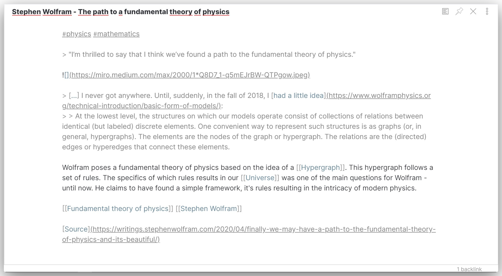

# Clean theme for Obsidian

A minimal and clean theme designed to be clutter-free and easy on the eye. Supports both dark and light mode.

### Features

- Clean colors

    Simple, neutral and close to monochrome.

- Dark mode

    

- Light mode

    

- Autohide sidedocks

    This theme has auto-hiding sidedocks. Just bring your cursor over to one of the sides to show them (currently, this feature makes windowed use pretty hard, so go maximized).

- Source and preview padding

    When only a single pane is open, the content is slightly padded, making reading easier.

## Installation

1. Download the `obsidian.css` file.
2. Put `obsidian.css` in your vault directory.
3. Go to Obsidian's settings and make sure you have the Custom CSS plugin enabled.
4. Enjoy!

---

Supports v0.5.1